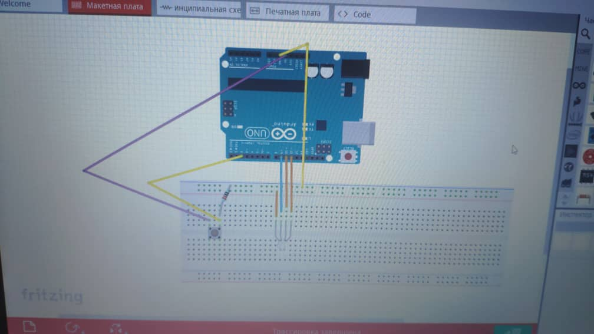

## Description
A small nightlight used to illuminate rooms, works through a power outlet. The most interresting idea of the night light is that the night kight was crated in the anime style of "Howl's Walking Castle". The night light is highlighted in different colors: red, blue, green,purple birch,orange and white.
## Images 

## Authors: 

#### Urmatbek Nusubaliev
#### Januzak Temirov
#### Aibek Koshmatov
#### Danil Aleshin

